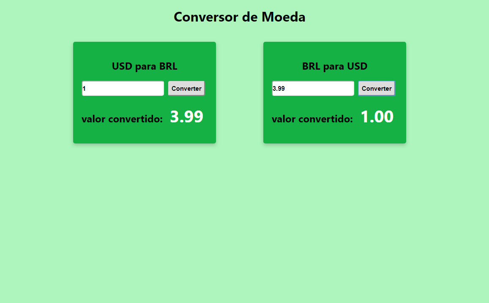

# Conversor de Moedas em ReactJS

## [Confira o resultado](http://marlonpaulo-conversor.netlify.com)

> Aplicação para converter moeda Dólar em Real e vice-versa Com conexão com a [API](https://free.currencyconverterapi.com/) para consultar o dolar em tempo real

Marlon Paulo - marlon.paulo.silva@outlook.com

[https://github.com/marlon-paulo-da-silva/github-link](https://github.com/marlon-paulo-da-silva/)

## Contribuição

1. Faça o _fork_ do projeto (<https://github.com/Marlon-Paulo-da-Silva/conversor-de-moedas-reactJS.git>)
2. Crie uma _branch_ para sua modificação (`git checkout -b feature/modificacoes`)
3. Faça o _commit_ (`git commit -am 'adicionar algumas modificacoes'`)
4. _Push_ (`git push origin feature/modificacoes`)
5. Crie um novo _Pull Request_
